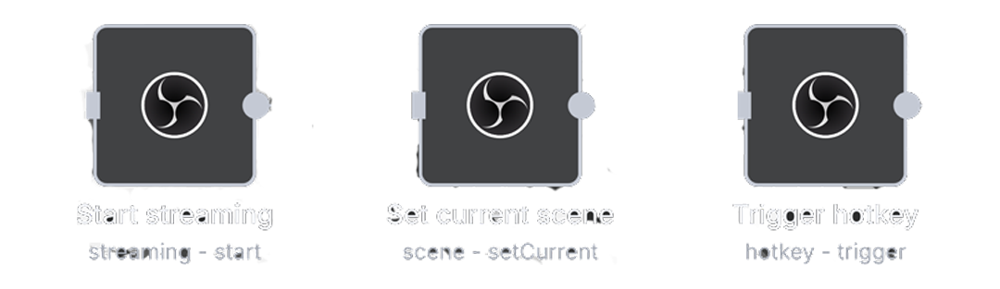

<h1 align="center">
  <br>
  <a href="/"></a>
  <br>
</h1>

# n8n-nodes-obs-websocket


Control [OBS Studio](https://obsproject.com/) directly from your [n8n](https://n8n.io) workflows using the native WebSocket protocol. Stream, record, manage scenes, control audio, apply filters, and much more - all automated!

[](https://www.npmjs.com/package/@mashgizmo/n8n-nodes-obs-websocket)
[](https://opensource.org/licenses/MIT)

## ✨ Features

This community node provides **comprehensive control** over OBS Studio with 60+ operations across 14 resource types:

- 🎥 **Streaming** - Start, stop, and monitor your streams
- 📹 **Recording** - Control recordings with pause/resume support
- 🎬 **Virtual Camera** - Enable OBS as a webcam for Zoom, Teams, etc.
- 🎨 **Scenes** - Switch between scenes programmatically
- 🔊 **Audio** - Mute/unmute sources and adjust volume levels
- 🎭 **Filters** - Enable/disable filters dynamically (color correction, chroma key, etc.)
- ↔️ **Transitions** - Control scene transitions and studio mode
- ▶️ **Media Control** - Play, pause, and control media sources
- 📝 **Text Sources** - Update text dynamically (countdowns, viewer counts, etc.)
- ⌨️ **Hotkeys** - Trigger any OBS hotkey remotely
- 📸 **Screenshots** - Capture and save screenshots of sources
- 📁 **Profiles & Collections** - Switch between different OBS configurations
- 📊 **Statistics** - Monitor CPU, FPS, and streaming metrics
- 🔧 **Source Management** - Show/hide sources and control visibility

## 📦 Installation

### From n8n GUI (Recommended)

1. Go to **Settings > Community Nodes**
2. Click **Install**
3. Enter `n8n-nodes-obs-websocket`
4. Click **Install**

### Manual Installation

```bash
# Navigate to your n8n custom nodes directory
cd ~/.n8n/custom

# Initialize npm if needed
npm init -y

# Install the package
npm install n8n-nodes-obs-websocket

# Restart n8n
```

### Docker Installation

Add to your `docker-compose.yml`:

```yaml
services:
  n8n:
    image: n8nio/n8n
    environment:
      - N8N_CUSTOM_EXTENSIONS=/home/node/.n8n/custom
    volumes:
      - n8n_data:/home/node/.n8n
```

Then install the package inside the container:

```bash
docker exec -it <container-name> sh
cd /home/node/.n8n/custom
npm install n8n-nodes-obs-websocket
exit
docker restart <container-name>
```

## 🎯 Prerequisites

1. **OBS Studio 28.0+** with built-in WebSocket support
2. Enable WebSocket in OBS:
   - Open OBS Studio
   - Go to **Tools → WebSocket Server Settings**
   - Check **Enable WebSocket server**
   - Set a password
   - Note the port (default: 4455)

## 🔐 Credentials Setup

Configure your OBS connection in n8n:

| Field | Description | Example |
|-------|-------------|---------|
| **Host** | OBS hostname or IP (without protocol) | `localhost` or `192.168.1.100` |
| **Port** | WebSocket port | `4455` (local) or `443` (remote WSS) |
| **Path** | Optional path for the endpoint | Leave empty or `/obs` |
| **Use Secure Connection** | Enable for WSS (remote/tunneled connections) | ☑️ for Cloudflare tunnels |
| **Password** | WebSocket password from OBS settings | Your password |

### Local Connection Example
```
Host: localhost
Port: 4455
Path: (empty)
Use Secure: ☐ No
Password: your_password
```

### Remote Connection (via Cloudflare Tunnel)
```
Host: your-tunnel.example.com
Port: 443
Path: (empty)
Use Secure: ☑️ Yes
Password: your_password
```

## 📚 Available Operations

### 🎥 Streaming
- **Get Status** - Check if streaming is active, get duration, bytes, frames
- **Start Streaming** - Begin streaming to configured service
- **Stop Streaming** - End the current stream
- **Toggle Streaming** - Toggle streaming on/off

### 📹 Recording
- **Get Status** - Check recording state (active, paused, duration)
- **Start Recording** - Begin recording
- **Stop Recording** - End recording
- **Pause Recording** - Pause recording
- **Resume Recording** - Resume paused recording
- **Toggle Recording** - Toggle recording on/off

### 🎬 Virtual Camera
- **Get Status** - Check if virtual camera is active
- **Start Virtual Camera** - Enable OBS as a webcam
- **Stop Virtual Camera** - Disable virtual camera
- **Toggle Virtual Camera** - Toggle virtual camera on/off

### 🎨 Scenes
- **Get Current Scene** - Get active scene information
- **List Scenes** - Get all available scenes
- **Set Current Scene** - Switch to a specific scene

### 🔧 Sources
- **List Sources** - Get all input sources
- **Get Settings** - Retrieve source configuration
- **Set Visibility** - Show or hide a source in a scene

### 🔊 Audio
- **Get Mute Status** - Check if audio source is muted
- **Mute** - Mute an audio source
- **Unmute** - Unmute an audio source
- **Toggle Mute** - Toggle mute on/off
- **Get Volume** - Get current volume level (0-100%)
- **Set Volume** - Set volume level (0-100%)

### 🎭 Filters
- **List Filters** - Get all filters on a source
- **Enable Filter** - Activate a filter
- **Disable Filter** - Deactivate a filter
- **Toggle Filter** - Toggle filter on/off

### ↔️ Transitions
- **Get Current Transition** - Get active transition details
- **List Transitions** - Get all available transitions
- **Set Current Transition** - Change the active transition
- **Trigger Transition** - Execute a studio mode transition

### ▶️ Media Control
- **Get Status** - Get media playback state and position
- **Play** - Play or unpause media
- **Pause** - Pause media playback
- **Restart** - Restart media from beginning
- **Stop** - Stop media playback
- **Next** - Skip to next media item
- **Previous** - Go to previous media item

### 📝 Text Sources
- **Set Text** - Update text in a text source (GDI+/FreeType2)
- **Get Text** - Retrieve current text from a source

### ⌨️ Hotkeys
- **Trigger Hotkey** - Execute any OBS hotkey by name
- **List Hotkeys** - Get all available hotkeys

### 📁 Profiles & Collections
- **Get Current Profile** - Get active profile name
- **List Profiles** - Get all available profiles
- **Set Current Profile** - Switch to a different profile
- **Get Scene Collection** - Get active scene collection
- **List Scene Collections** - Get all collections
- **Set Scene Collection** - Switch scene collection

### 📸 Screenshots
- **Take Screenshot** - Capture a source (returns base64 image)
- **Save Screenshot** - Capture and save to file
  - Custom resolution support
  - PNG/JPG format options

### 📊 General
- **Get Version** - OBS and WebSocket version info
- **Get Stats** - CPU usage, FPS, memory, disk space
- **Get Studio Mode Status** - Check if studio mode is enabled
- **Enable Studio Mode** - Activate studio mode
- **Disable Studio Mode** - Deactivate studio mode

## 🤝 Contributing

Contributions are welcome! Please feel free to submit a Pull Request or open an issue for bugs and feature requests.

## 📄 License

[MIT](LICENSE.md)


---

**If this node helps you, please ⭐ star the repository!**

